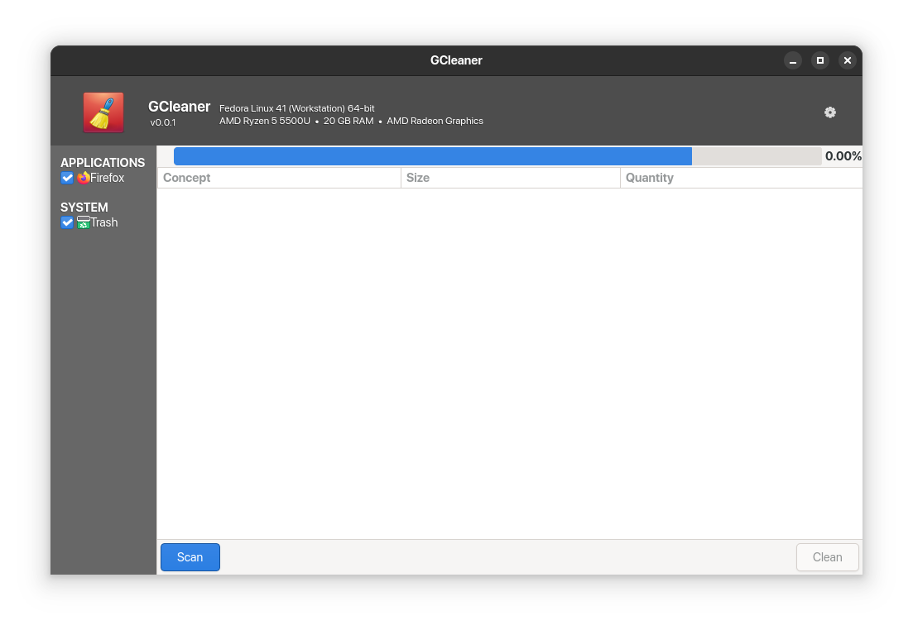

# GCleaner

GCleaner is a beautiful and fast system cleaner for GNU/Linux distributions. See more information on their website [https://gcleaner.github.io/](https://gcleaner.github.io/)



This version of GCleaner is a rewriten version using Python 3 lang and GTK+ 4.0.

- Registered by [Juan Pablo Lozano](mailto:libredeb@gmail.com) on May 04, 2015.
- Starter project: [https://launchpad.net/gcleaner](https://launchpad.net/gcleaner)

## How to Get Involved?

There are several ways to contribute to the project, by the moment the goal is to get a functional version of the project. Translations to other languages, bug fixes, among other things will be left for later.

If you want to test the progress of the project and/or contribute with code, follow the steps below:

1. Clone the git repository:
    ```sh
    git clone https://github.com/gcleaner/gcleaner-python.git
    ```

2. Install development dependencies:
    - **In Fedora:**
        ```sh
        sudo dnf install gtk4-devel python3-gobject-devel python3-psutil python3-pytest polkit dmidecode
        ```

    - **In Ubuntu:**
        ```sh
        sudo apt-get install libgtk-4-dev python-gi-dev python3-psutil python3-pytest pkexec dmidecode
        ```

3. Install GLib schema:
    ```sh
    sudo cp data/schemas/org.gcleaner.gschema.xml /usr/share/glib-2.0/schemas/
    ```

4. Compile GLib schema:
    ```sh
    sudo glib-compile-schemas /usr/share/glib-2.0/schemas/
    ```

5. Install Polkit actions and rules:
    ```sh
    sudo cp data/polkit/org.gcleaner.specs.dmidecode.policy /usr/share/polkit-1/actions/
    ```
    ```sh
    sudo cp data/polkit/50-gcleaner.rules /etc/polkit-1/rules.d/
    ```
    > **NOTE:** more information about Polkit [here](https://polkit.pages.freedesktop.org/polkit/).

6. Use an IDE like Visual Studio Code (recommended) to execute the app or run next command:
    ```sh
    python3 gcleaner/application.py
    ```

## How to inspect a GTK+ Application?

To debug GTK+ widgets, you can use the GTK Widget Inspector, which is a built-in tool that allows you to test CSS changes, check the UI structure, widget properties and more. To launch this tool use any of the following methods:

1. Use the keyboard shortcut `Control` + `Shift` + `I` (or in some cases: `Control` + `Shift` + `D`).
2. Set the environment variable `GTK_DEBUG=interactive` before launch your application.

## How to run unit test?    

To execute unit tests, you can run commands like this one:

```sh
PYTHONPATH=$(pwd)/gcleaner pytest -v tests/plugins/test_firefox.py
```